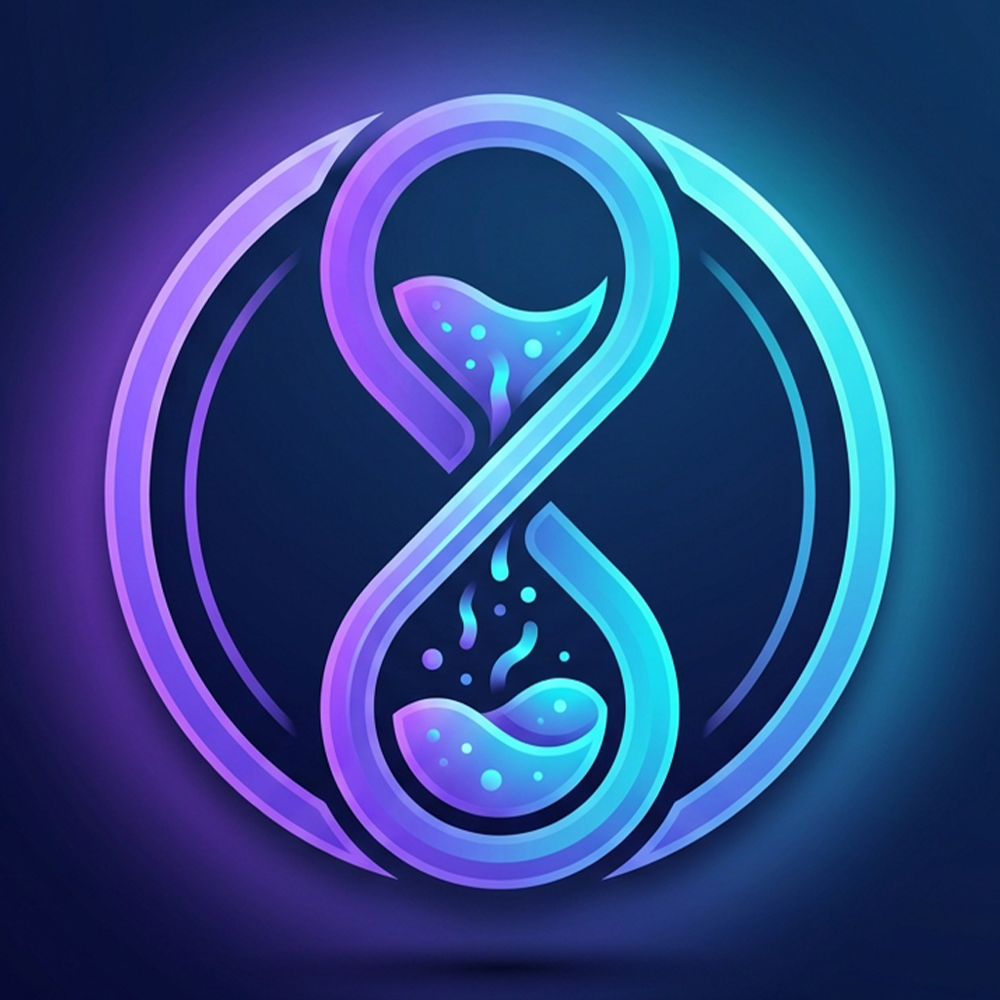
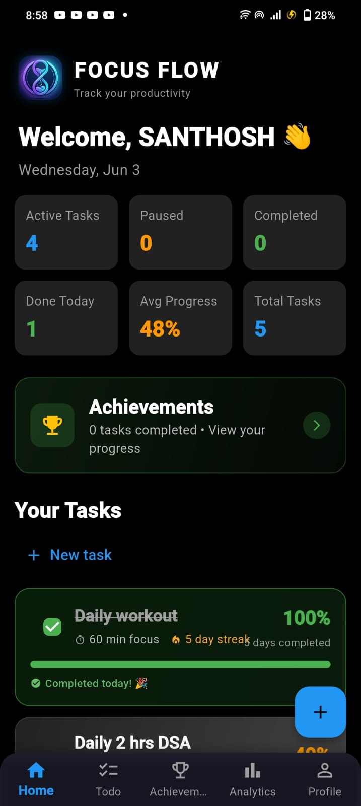
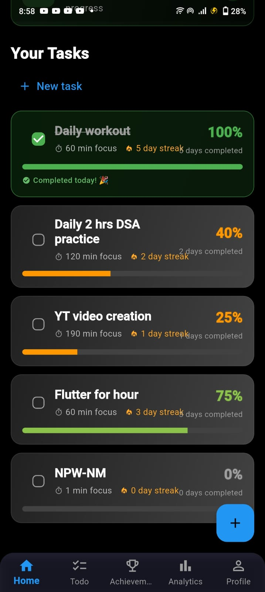
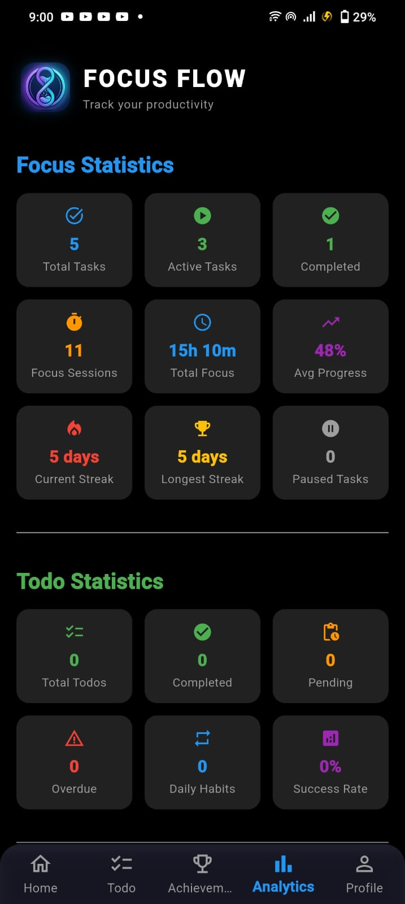
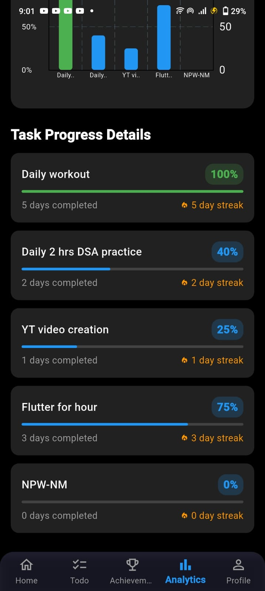
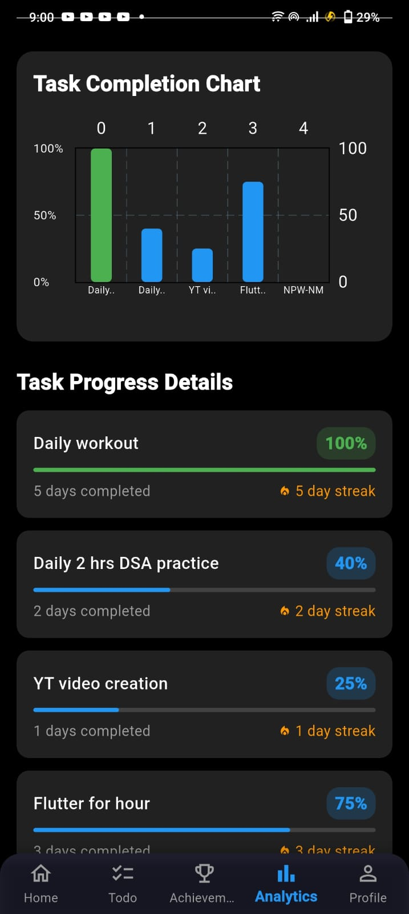
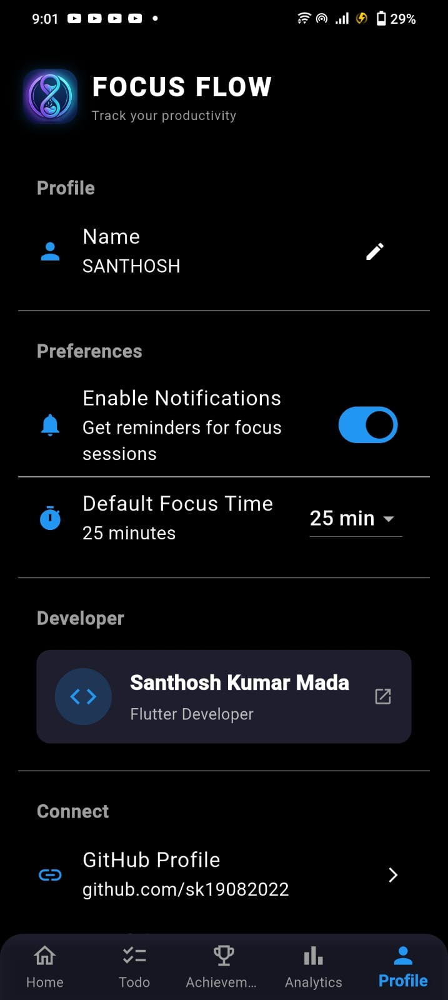
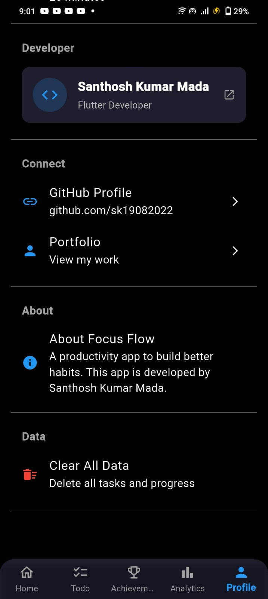
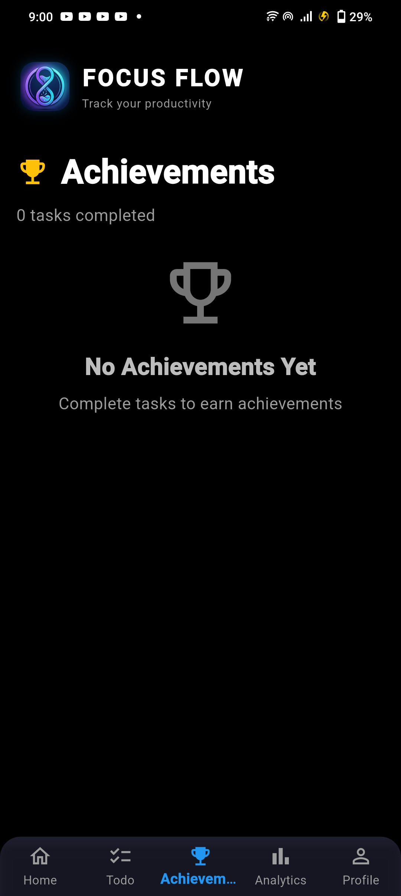
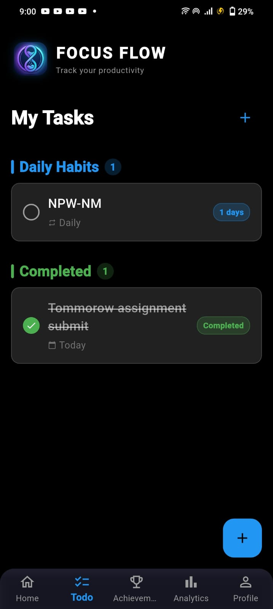

# 🚀 Focus Flow

<p align="center">
  
</p>

<p align="center">
  <b>Focus Better. Stay Consistent. Track Progress.</b>
</p>

<p align="center">
  A modern productivity app built with Flutter that helps users stay focused,
  build habits, complete goals, and track long-term progress.
</p>

---

## 📱 Download

### Android APK

👉 **Download Latest APK**

[](https://drive.google.com/file/d/1qRGxHIXZqgNafjmFlWaMVBYY1Y_hPXp4/view?usp=sharing)

---

## 🌟 About Focus Flow

Focus Flow is a productivity-focused mobile application that combines:

- 🎯 Focus Sessions with Persistent Timer
- ⏳ Smart Timer (Resumes after navigation)
- 📊 Productivity Analytics
- 📅 Calendar Tracking
- ✅ Todo Management (One-Time & Daily)
- 🏆 Achievements System
- 📋 Sub-Tasks for Goal Breakdown
- ✏️ Task Editing with History
- 🔔 Smart Notifications *(Planned)*

into one clean and distraction-free experience.

Whether you're:

- 📚 A Student
- 💻 A Developer
- 🎨 A Creator
- 🏋️ A Fitness Enthusiast

Focus Flow helps you stay accountable and productive every day.

---

# ✨ Features

## 🎯 Focus Tasks

Create productivity-oriented tasks such as:

- Read 30 Minutes
- Learn Flutter
- Practice DSA
- Workout
- Learn UI Design

Each task contains:

✅ Task Name (Editable)

✅ Focus Duration (Editable)

✅ Progress Tracking

✅ Calendar History

✅ Completion Statistics

✅ Sub-Tasks Checklist

✅ Edit History Log

---

## ⏳ Persistent Focus Timer

Every task comes with a smart, persistent Pomodoro-style timer.

### Controls

▶️ Start

⏸ Pause

🔄 Resume

🏁 Complete Session

🔄 Reset

### Persistent Timer Features

- ✅ Timer state survives screen navigation
- ✅ Timer continues counting when app is minimized
- ✅ Reopening a task restores exact remaining time
- ✅ Running/Paused state preserved across app restarts
- ✅ Progress calculated using timestamps (not just UI state)

When a session finishes:

- Task progress updates automatically
- Completion date is saved
- Calendar gets updated
- Focus session recorded with original duration (historical data preserved)
- Completion sound plays
- Session counts toward analytics

---

## ✏️ Task Editing & History

### Edit Task Options

- ✏️ Rename Task
- ⏱️ Change Focus Duration

**Important:** Changing duration does NOT affect historical focus records. Past completed sessions remain unchanged.

### Edit History

Every task modification is logged:

- 📅 Date & Time of change
- 📝 Type of change (Rename / Duration)
- 🔄 Old value → New value

Example History Entry:

June 8, 2026 at 14:30
Focus Duration Changed
60 min → 30 min


---

## 📋 Sub-Tasks System

Break down large tasks into manageable checklist items.

### Features

- ✅ Add unlimited sub-tasks
- ✅ Mark/unmark completion
- ✅ Edit sub-task names
- ✅ Delete sub-tasks
- ✅ Visual progress indicator (X/Y completed)
- ✅ Strike-through text for completed items

Example:

Sub-Tasks
☐ 20 Minutes Running
☑ ~~20 Pull-Ups~~
☐ Stretching

Add Another Sub-Task


---

## 📅 Calendar Progress Tracker

Track your productivity visually with color-coded indicators.

### Calendar Indicators

| Status | Color | Meaning |
|--------|-------|---------|
| 🟢 | Green | Completed |
| 🔴 | Red | Missed |
| 🟣 | Purple | Task Creation Date |
| 🟡 | Yellow | Today |
| ⚪ | Grey | Future / Disabled |

### Calendar Features

- ✅ Month navigation
- ✅ Real-time updates after completion
- ✅ Day selection with details
- ✅ Visual legend
- ✅ Starts from task creation date (no false missed days)

---

## 📊 Analytics Dashboard

Track your performance with comprehensive analytics.

### Focus Statistics Metrics

📈 **Total Tasks** - All tasks created

📈 **Active Tasks** - Currently in progress

📈 **Completed Tasks** - Permanently completed

📈 **Focus Sessions** - Total completed sessions

📈 **Total Focus Time** - Cumulative focus minutes (preserved historically)

📈 **Average Progress** - Average completion percentage

📈 **Current Streak** - Longest active streak

📈 **Longest Streak** - All-time best streak

📈 **Paused Tasks** - Temporarily paused

### Todo Statistics Metrics

✅ **Total Todos** - All created todos

✅ **Completed** - Finished on time

✅ **Pending** - Not yet due

✅ **Overdue** - Past due date

✅ **Daily Habits** - Active daily routines

✅ **Success Rate** - Daily habit completion percentage

### Charts & Visualizations

- 📊 Bar Chart for Task Completion
- 📈 Progress indicators
- 📉 Trend analysis

### Analytics Features

- 🔄 Pull-to-refresh
- 📱 Real-time updates
- 💾 Historical data preservation

---

## ✅ Todo Management System

Separate from focus tasks for better organization.

### One-Time Todos

**Examples:**
- Finish Assignment
- Submit Project
- Attend Interview

**Features:**
- ✅ Set due date
- ✅ Mark complete (permanent)
- ✅ Auto-move to Achievements
- ❌ Cannot be unchecked after completion

**Status Types:**
| Status | Color | Description |
|--------|-------|-------------|
| 🟡 Pending | Amber | Not yet due |
| 🟢 Completed | Green | Finished on time |
| 🔴 Overdue | Red | Past due date |

---

### Daily Habits

**Examples:**
- Exercise
- Drink Water
- Meditation
- Journal Writing

**Features:**
- ✅ Track daily
- ✅ Auto-reset each day
- ✅ Cannot complete same day twice
- ✅ Calendar tracking per day
- ✅ Historical streak tracking

**Status Display:**
- 🟢 "Completed Today" badge when done
- 📅 Calendar shows green for completed days
- 🔴 Calendar shows red for missed days

---

## 🏆 Achievements System

Completed goals move into a dedicated achievements section.

### What Gets Tracked

**Focus Tasks:**
- 🏅 Task name
- 📅 Start date
- 📅 Completion date
- ⏱️ Total days tracked
- 🎯 Total focus minutes

**One-Time Todos:**
- 📋 Task name
- 📅 Created date
- ✅ Completed date
- 🎯 Completion status

### Display Features
🏆 Flutter Course
Completed Successfully

Started: 1/6/2026
Completed: 15/6/2026
14 days tracked • 60 min sessions


Achievements create a permanent history of your accomplishments.

---

## 👤 User Profile & Onboarding

### First-Time User Experience

- ✨ Welcome screen on first launch
- 👤 Ask for user name
- 💾 Save locally
- 🚀 Direct to main app

### Profile Features

- 📝 Edit name anytime
- 💾 Persists across app restarts
- 🔄 Syncs with settings

---

## 🔄 Data Persistence

### Local Storage

All data is stored locally using SharedPreferences:

- ✅ Focus tasks & history
- ✅ Todo items
- ✅ Achievements
- ✅ User profile
- ✅ App settings
- ✅ Timer state
- ✅ Edit history

### Data Safety

- ✅ No cloud dependency
- ✅ Works offline
- ✅ Backup & restore support
- ✅ Historical data never recalculated
- ✅ Edit duration doesn't affect past sessions

---

## 📸 Screenshots

### 🏠 Home Screen

<p align="center">
  
  
</p>

---

### 📊 Analytics

<p align="center">
  
  
  
</p>

---

### ⚙️ Settings

<p align="center">
  
  
</p>

---

### 🏆 Achievements

<p align="center">
  
</p>

---

### ✅ Todo Management

<p align="center">
  
</p>

---

### 📋 Task Details with Sub-Tasks

<p align="center">
  
  
</p>

---

## 🛠 Tech Stack

### Frontend
- Flutter
- Dart

### State Management
- StatefulWidget with ValueNotifier
- Provider pattern for services

### Local Storage
- SharedPreferences
- JSON serialization

### UI
- Material Design 3
- Custom Components
- Responsive Layouts

### Charts
- FL Chart for analytics

### Calendar
- Table Calendar

### Notifications *(Planned)*
- Flutter Local Notifications

---

## 📂 Project Structure

```bash
lib/
│
├── models/           # Data models (Task, Todo, Achievement, User)
├── screens/          # UI screens (Home, Analytics, Todo, Settings, etc.)
├── widgets/          # Reusable components (AppHeader, TaskCard, StatsCard)
├── services/         # Business logic (TaskService, TodoService)
│
└── main.dart         # App entry point


🚀 Getting Started
Prerequisites
Flutter SDK (>=3.0.0)

Dart SDK (>=3.0.0)

Android Studio / VS Code


git clone https://github.com/sk19082022/FocusFlowMobileAPP.git

Open Project
bash
cd FocusFlowMobileAPP
Install Packages
bash
flutter pub get
Run App
bash
flutter run
📦 Building
Debug APK
bash
flutter build apk --debug
Release APK
bash
flutter build apk --release
Split APKs (Recommended)
bash
flutter build apk --split-per-abi --release
Web Build
bash
flutter build web --release
🗺 Roadmap
Version 2.0 (Current)
✅ Persistent Timer

✅ Task Editing with History

✅ Sub-Tasks System

✅ Achievements Section

✅ Daily Habits

✅ One-Time Todos

✅ Todo Deadline Tracking

✅ Analytics Dashboard

✅ Pull-to-Refresh

✅ First-Time Onboarding

✅ Backup & Restore

✅ Calendar Progress Tracking

Version 2.1 (Upcoming)
Push Notifications

Widget Support

Dark/Light Theme Toggle

Export Data (CSV/JSON)

Task Templates

Version 3.0 (Future)
Cloud Sync

User Accounts

Cross-Device Sync

Web Dashboard

Team Collaboration

🤝 Contributing
Contributions are welcome!

Fork the repository

Create a feature branch

bash
git checkout -b feature/new-feature
Commit changes

bash
git commit -m "Added new feature"
Push changes

bash
git push origin feature/new-feature
Open Pull Request

👨‍💻 Developer
Santhosh Kumar Mada
GitHub: @sk19082022

Project Repository: FocusFlowMobileAPP

💡 Vision
Focus Flow is being built as a complete productivity ecosystem that combines:

✅ Deep Focus Sessions with Persistent Timer

✅ Habit Tracking (Daily & One-Time)

✅ Goal Management with Sub-Tasks

✅ Achievement Tracking

✅ Comprehensive Analytics

✅ Edit History & Audit Trail

✅ Smart Notifications (Planned)

✅ Personal Growth Tools

The ultimate goal is to help users stay consistent and achieve meaningful long-term progress.

📄 License
This project is open-source and available under the MIT License.

🙏 Acknowledgments
Flutter team for the amazing framework

All contributors and testers

Users who provided valuable feedback

⭐ Support
If you found this project useful:

⭐ Star the repository

🍴 Fork the project

📢 Share it with friends

🐛 Report issues

💡 Suggest features

Your support helps improve Focus Flow and motivates future development.

<p align="center"> <b>Made with ❤️ using Flutter</b> </p><p align="center"> <sub>Stay Focused • Build Habits • Track Progress</sub> </p> ```